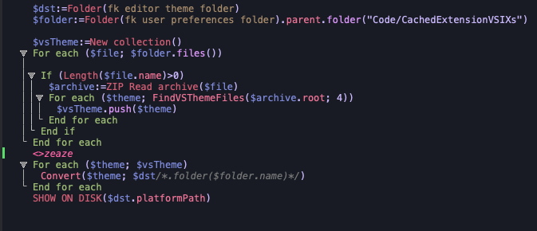

# Viva Theme



## To install

Take JSON files and put them into 4D editor themes folder.

- on macOS `$HOME/Library/Application Support/4D/4D Editor Themes`
- on Window `<diskName>:\Users\userName>\AppData\Roaming\4D\4D Editor Themes`

Then select it in 4D v19+ [preferences](https://developer.4d.com/docs/Preferences/methods/#themes).

### On macOS

Open a terminal you can type

```bash
curl -sL https://raw.githubusercontent.com/mesopelagique/viva-theme/main/viva-theme.json -o $HOME/Library/Application\ Support/4D/4D\ Editor\ Themes/viva-theme.json
```

## Others

[Other 4D Editor Themes](https://github.com/topics/4d-theme)

### Convert any visual studio code theme to 4D theme

https://github.com/mesopelagique/VSThemeConverter

### Other components

[](https://mesopelagique.github.io/)

### Accent color

To force the pink as accent color for 4D only, in terminal

```bash
defaults write com.4D.4D AppleAccentColor -int 6
```
